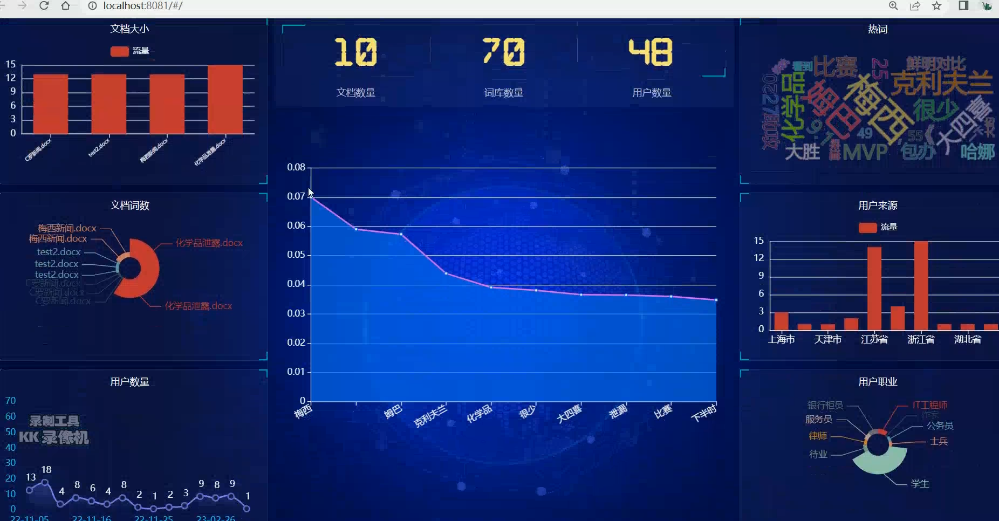
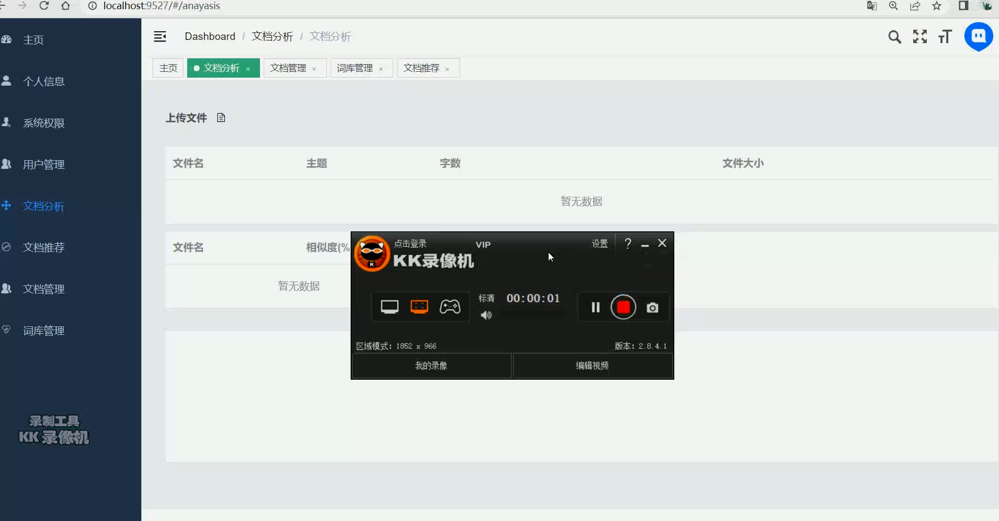
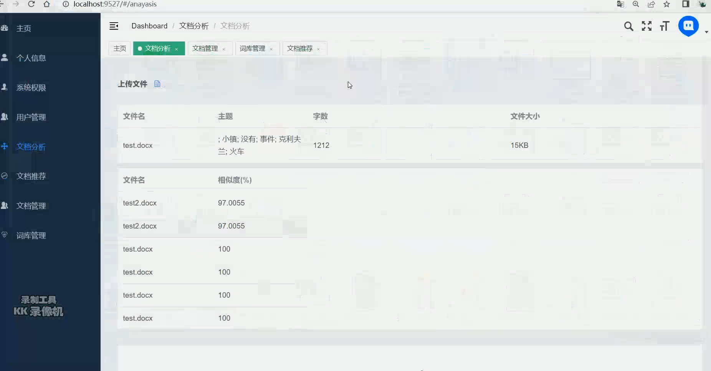
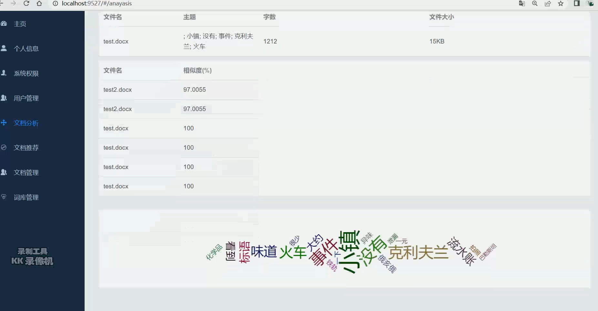
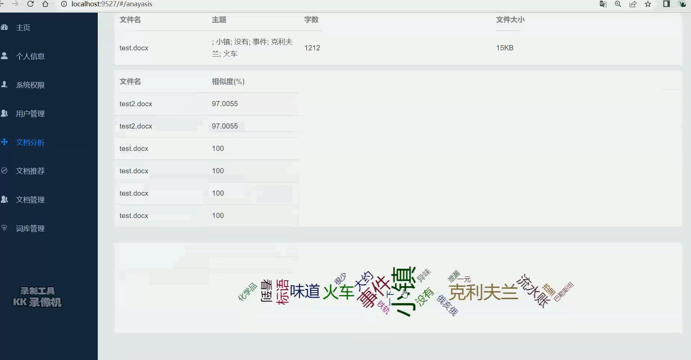
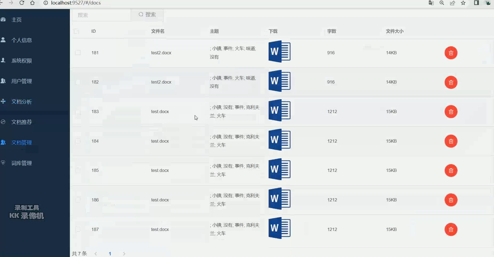
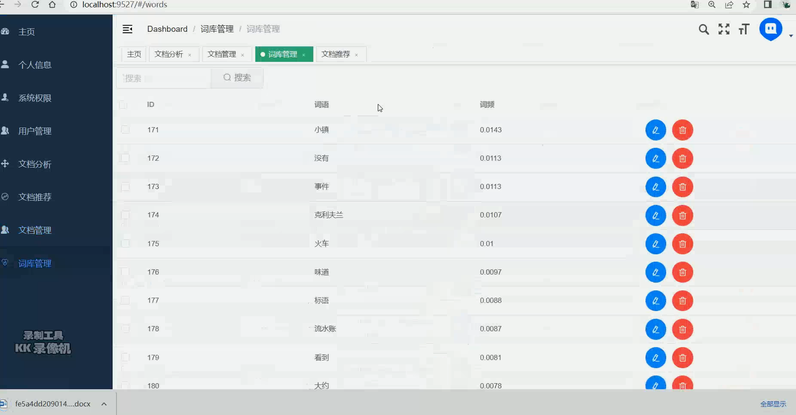

## 计算机毕业设计吊打导师Spark+SpringBoot文档主题词自动提取分析与推荐系统  数据自动标注系统 文档自动提取系统 大数据毕业设计 大数据毕设 

## 要求
### 源码有偿！一套(论文 PPT 源码+sql脚本+教程)

简易

https://www.bilibili.com/video/BV17g4y1E76T/?spm_id_from=333.999.0.0

### 
### 加好友前帮忙start一下，并备注github有偿课程推荐
### 我的QQ号是2827724252或者798059319或者 1679232425或者微信:bysj2023nb

# 

### 加qq好友说明（被部分 网友整得心力交瘁）：
    1.加好友务必按照格式备注
    2.避免浪费各自的时间！
    3.当“客服”不容易，repo 主是体面人，不爆粗，性格好，文明人。

# 开发技术
前端：vue.js

后端：springboot+mybatis-plus

数据库：mysql 

算法(机器学习、深度学习)：IK分析、lstm情感分析、文本分类

大数据分析：spark、echarts hadoop

# 特色/创新点
文档机器学习深度学习自动提取

协同过滤算法文档推荐

数据可视化大屏

# 运行截图

# 运行视频(B站)

https://www.bilibili.com/video/BV17g4y1E76T/?spm_id_from=333.999.0.0

